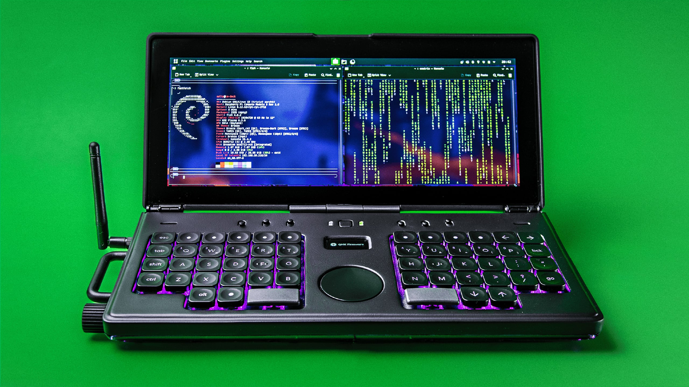

    

Watch the build video ↓

CM Deck is a clamshell style cyberdeck built around the Raspberry Pi Compute Module 5. It has a custom carrier board and a low profile mechanical keyboard.

⚠️ The PCBs will be updated to fix three issues: 1. The flash chip CS pin isn’t connected (see video at [11:09](https://youtu.be/U5GZeMm5nhI?si=vS6aNDHk9gTeop53&t=669)) | 2. Add jumper pads for the power button so I can solder wires and connect it to the power board (see video at [16:32](https://youtu.be/U5GZeMm5nhI?si=_Pz7x-TjfpxkA6fn&t=992)) | 3. Add an open jumper pad on the 3V3 line of the DSI connector on the main board (see video at [15:09](https://youtu.be/U5GZeMm5nhI?si=e3sX7tEprCDsY_S7&t=909))

[![CC BY-NC-SA 4.0][cc-by-nc-sa-shield]][cc-by-nc-sa]

[![CC BY-NC-SA 4.0][cc-by-nc-sa-image]][cc-by-nc-sa]

[cc-by-nc-sa]: http://creativecommons.org/licenses/by-nc-sa/4.0/
[cc-by-nc-sa-image]: https://licensebuttons.net/l/by-nc-sa/4.0/88x31.png
[cc-by-nc-sa-shield]: https://img.shields.io/badge/License-CC%20BY--NC--SA%204.0-lightgrey.svg